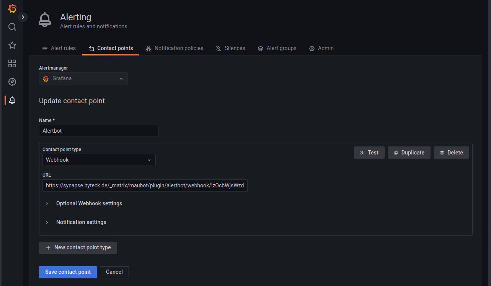

# Getting Started

**Prerequisites:**
* A maubot instance: Please [refer to the docs](https://docs.mau.fi/maubot/usage/setup/index.html) for setting up one
* An instance of alertmanager or grafana or a similar alerting program that is able to send webhooks

**Getting the code**

Clone this repository to your local computer and install maubot to have access to the maubot CLI
```shell
git clone https://github.com/moan0s/alertbot
pip install maubot
```

**Login to your maubot instance**

```shell
mbc login
```

**Build&Upload the plugin**

```shell
mbc build -u
```

You now have the plugin installed. Now you have to set up an instance of the bot in the maubot manager and invite it to
the room where the alerts should be sent. Also find out the room id by asking the bot for it with `!roomid`.


**Configure alertmanager**

This configuration will send all your alerts to the room `!zOcbWjsWzdREnihgeC:example.com` (if the bot has access to it).
Put in your own room-id (see above).
```yaml

receivers:
- name: alertbot
  webhook_configs:
  - url: https://synapse.hyteck.de/_matrix/maubot/plugin/alertbot/webhook/!zOcbWjsWzdREnihgeC:example.com
route:
  group_by:
  - alertname
  - cluster
  - service
  group_interval: 5m
  group_wait: 30s
  receiver: alertbot
  repeat_interval: 3h

```

# Local testing Setup

Use a domain e.g. webbhook.hyteck.de and configure nginx as 
reverse proxy for port 4242 for this domain.

# Connect

Run the local server and connect via (29316 is the local maubot port)
`ssh -N -R 4242:localhost:29316 s`

# Send some data with

Put the following in `data.json`
```json
{"receiver":"matrix","status":"firing","alerts":[{"status":"firing","labels":{"alertname":"InstanceDown","environment":"h2916641.stratoserver.net","instance":"localhost:9100","job":"node_exporter","severity":"critical"},"annotations":{"description":"localhost:9100 of job node_exporter has been down for more than 5 minutes.","summary":"Instance localhost:9100 down"},"startsAt":"2022-06-23T11:53:14.318Z","endsAt":"0001-01-01T00:00:00Z","generatorURL":"http://h2916641.stratoserver.net:9090/graph?g0.expr=up+%3D%3D+0\u0026g0.tab=1","fingerprint":"9cd7837114d58797"}],"groupLabels":{"alertname":"InstanceDown"},"commonLabels":{"alertname":"InstanceDown","environment":"h2916641.stratoserver.net","instance":"localhost:9100","job":"node_exporter","severity":"critical"},"commonAnnotations":{"description":"localhost:9100 of job node_exporter has been down for more than 5 minutes.","summary":"Instance localhost:9100 down"},"externalURL":"https://alert.hyteck.de","version":"4","groupKey":"{}:{alertname=\"InstanceDown\"}","truncatedAlerts":0}
```
and then 
```shell
curl --header "Content-Type: application/json" \
  --request POST \
  --data "@data.json" \
  https://webhook.hyteck.de/_matrix/maubot/plugin/maubot/webhook
```


# Grafana setup

The grafana setup is fairly simple and can be used to forward grafana alerts to matrix.

